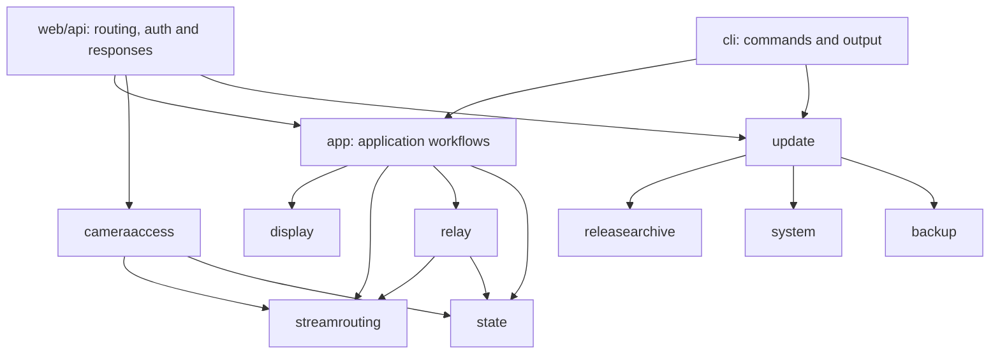

# Backend module ownership

`app.Open` composes configuration, SQLite state and application workflows. HTTP
handlers and CLI commands call those workflows or the feature module that owns
an operation. JSON fields, routes, settings keys and the database schema remain
compatible with the existing frontend.

## Where a change belongs

| Module | Owns | Entry points and test surface |
| --- | --- | --- |
| `app` | Discovery, binding workflows, viewer assembly, watchdog scheduling and support bundles | Application methods compose feature results and persist decisions. `Relays()` returns one manager per application. |
| `display` | Layout presets, custom cells, slot order, transforms and crop normalization | `Resolve(settings, slots)` and `Transform(settings, deviceID)` are deterministic and perform no I/O. |
| `streamrouting` | Direct/relay candidates, path policies, failure/recovery counters and stable selection | `Assess(ctx, input, probe)` returns an assessment and proposed state values. It never writes settings. Read-only viewer checks do not advance watchdog counters. |
| `relay` | SSH forwards, process checks, pidfiles, lifecycle locking, status and restart backoff | One `Manager` provides `Statuses`, `Start`, `Stop`, `Restart` and `Ensure`. Process/probe adapters can be replaced in tests; SQLite remains real. |
| `cameraaccess` | Camera and identity credentials, preview capture, reference images and probe results | `Service` resolves credential candidates and returns redacted results. HTTP status codes are assigned only by the transport. Capture adapters belong to an instance, so tests do not change global process state. |
| `snapshotupload` | Upload destination validation, per-camera upload crop, JPEG preparation and FTP/SFTP transfer | `Service` receives the existing camera capture workflow and a replaceable transfer adapter. Protocol tests use loopback servers and synthetic JPEGs. Passwords belong to `secrets`; public configuration and crops use dotted state settings. |
| `releasearchive` | Source validation, download, digest verification, extraction and staging lifetime | `Prepare` returns a release with root and manifest. The caller defers `Close`. Failed preparation cleans staging. `OpenDirectory` borrows a source directory and never deletes it. |
| `update` | Catalog queries, installation, persistent jobs, exclusion, backup, recovery metadata and rollback | `Catalog.Check` owns GitHub release interpretation. Both installation and update use `releasearchive.Prepare`. The durable worker owns restart and health checks. |
| `web/api` | Route registration, request decoding, auth, cookies, HTTP errors and response encoding | Feature handlers live beside related routes. Camera operations call `cameraaccess`; release checks call `update.Catalog`. |

## Dependency rules

Feature modules do not import `app`, `web/api` or `cli`. The composition layer
supplies the endpoint resolver to `cameraaccess`; that module does not know about
`App`. The relay manager receives the configured RTSP probe from `App` and owns
its own mutex. This keeps watchdog and HTTP-triggered relay operations on the
same lifecycle lock.

Layout and path evaluation perform no direct filesystem, network or SQL I/O.
Path candidate construction consumes existing `state.Binding` records as input;
this is a type dependency, not a store opened by the evaluator. Keep persistence
in the calling workflow so a status read cannot silently become a state update.

The update package separates deployment file operations, platform setup, HTTP
health checks and metadata persistence. Archive preparation owns temporary files
in both install and update flows. The supervisor, OS lock, job ID, version check
and rollback deadline retain their existing behavior. See [recovery](recovery.md)
for operational requirements.

## Verification

`internal/architecture` tests enforce the dependency direction and the direct I/O
restriction for layout and routing. Module tests exercise stable failover,
credential fallback and redaction, reference image confinement, release staging
cleanup and real child-worker execution. Existing API, viewer and watchdog tests
continue to cover the composition of these modules.

Run `make test`; run `go test -race ./...` and `go vet ./...` inside
`camera-manager` for backend verification. CI also type-checks and builds the
frontend. Live SSH, systemd, Docker and physical camera operation still require
an appliance smoke test.
